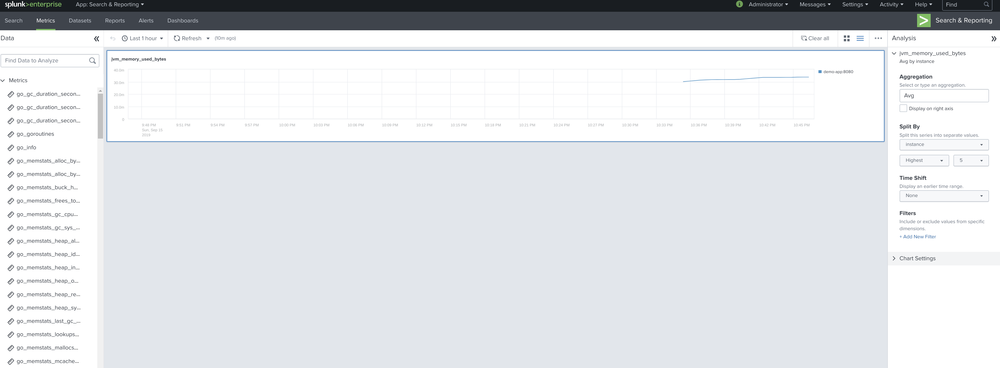

# Spring Boot Micrometer Prometheus Metrics Splunk indexing

## Introduction
This project shows how to get metrics from Spring Boot, using [Micrometer](https://micrometer.io)'s Prometheus registry,
and index those metrics in Splunk through a metrics index.

It uses the [Splunk Prometheus App](https://github.com/lukemonahan/splunk_modinput_prometheus) to scrape metrics
from Prometheus' `/federate` API. 

See [Prometheus Federation](https://prometheus.io/docs/prometheus/latest/federation/)

The same principles apply to any metrics that Prometheus can read, not just Spring / Micrometer metrics.

## Setup
`mvn clean install` to build the demo app

`docker-compose up` to bring up the app, Splunk and Prometheus

Open [Splunk UI](http://localhost:8000/en-US/app/search/analysis_workspace) (admin:password)

You will see the collected metrics in the metrics dropdown on the left side.

